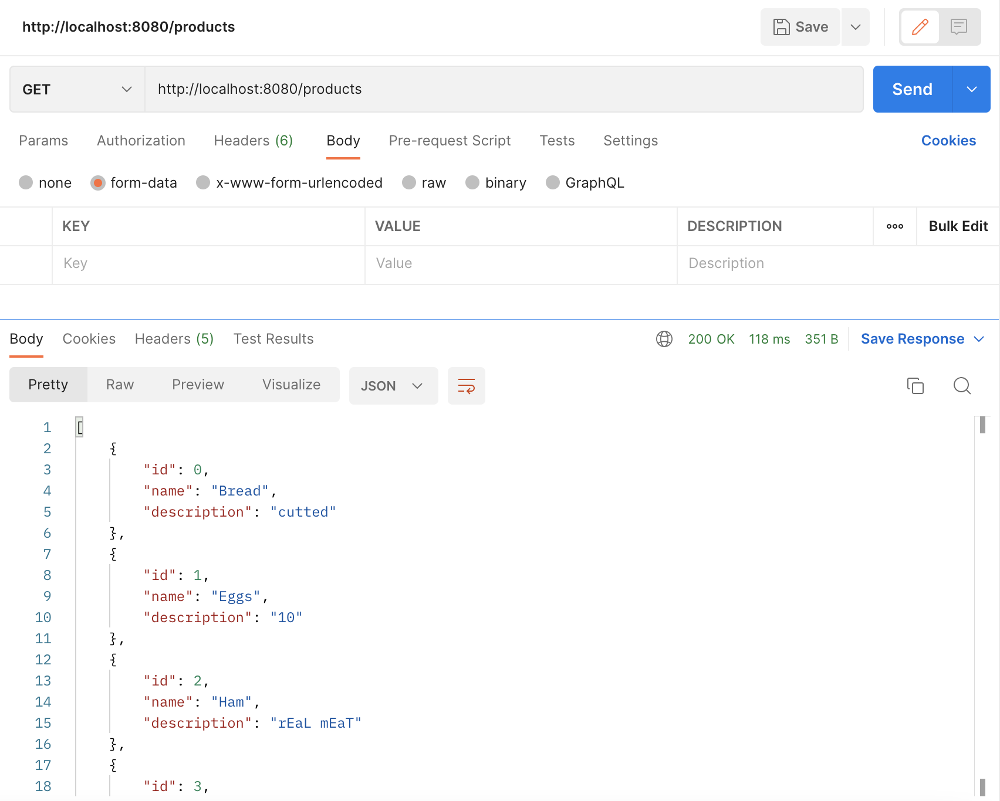
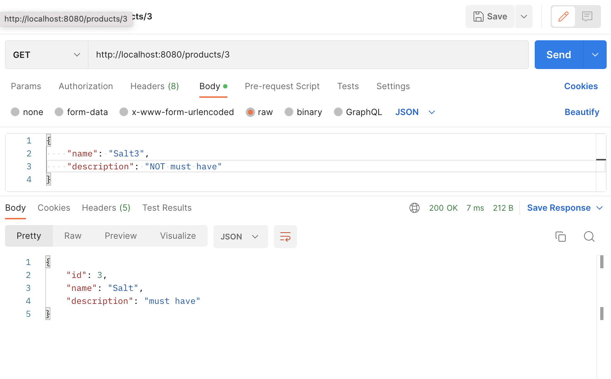
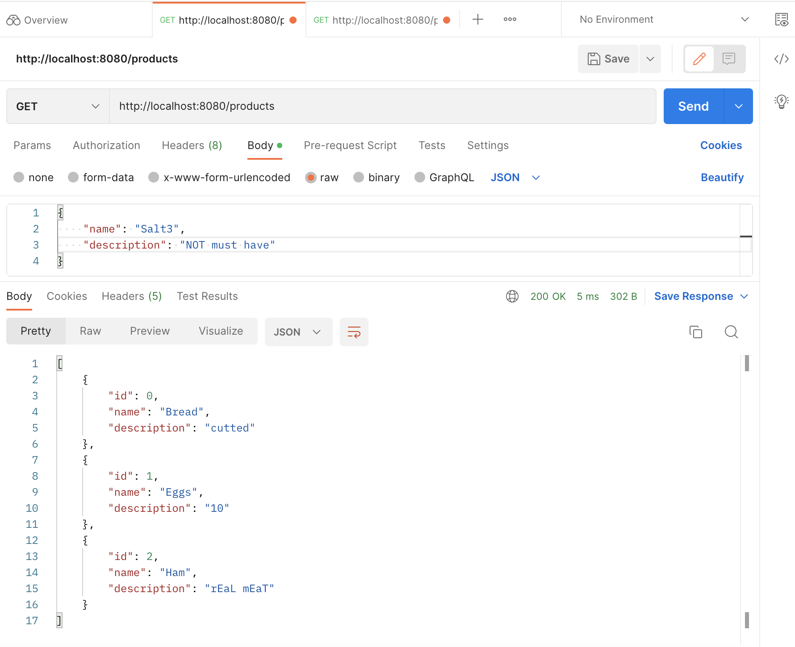

# Networks_HW_2

Был реализован REST Service на языке Java с помощью Spring.
Сначала получили все тестовые данные

Изменили по id 3 название и описание

Удалили 3 элемент и еще раз получили весь список

