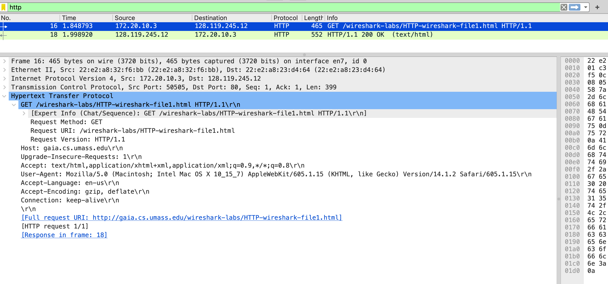
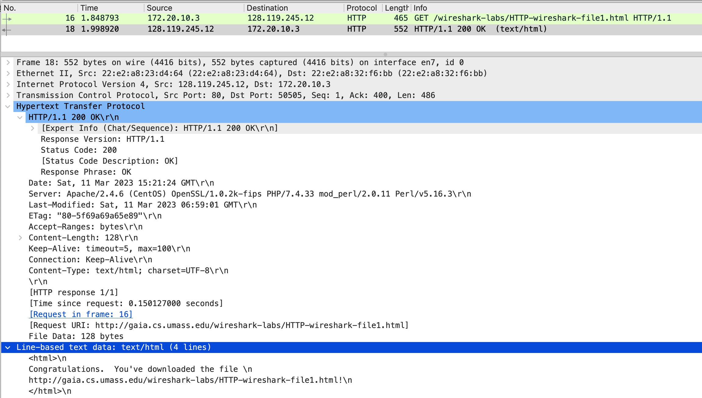
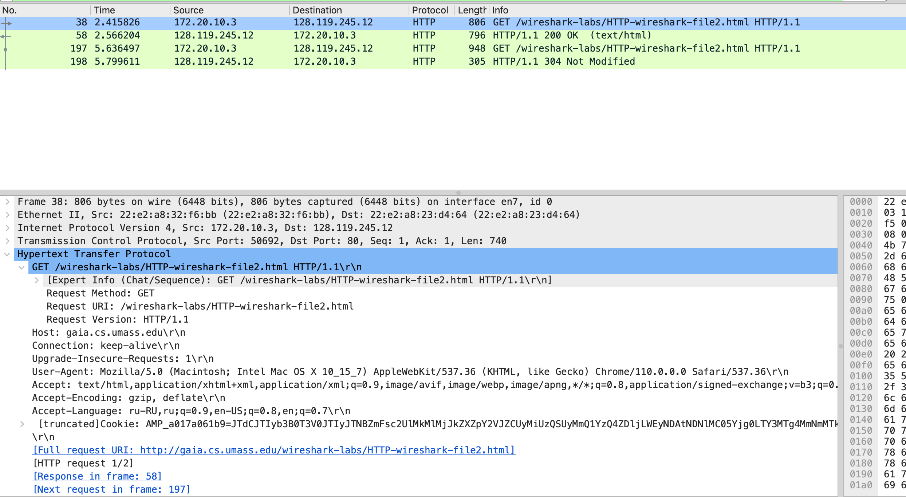
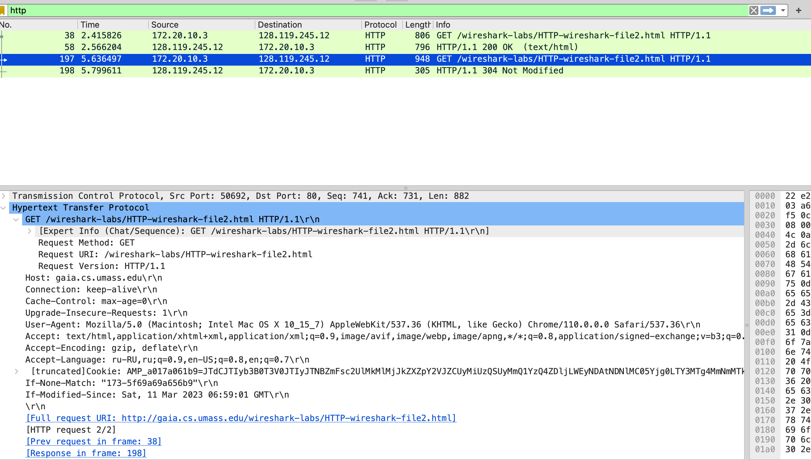
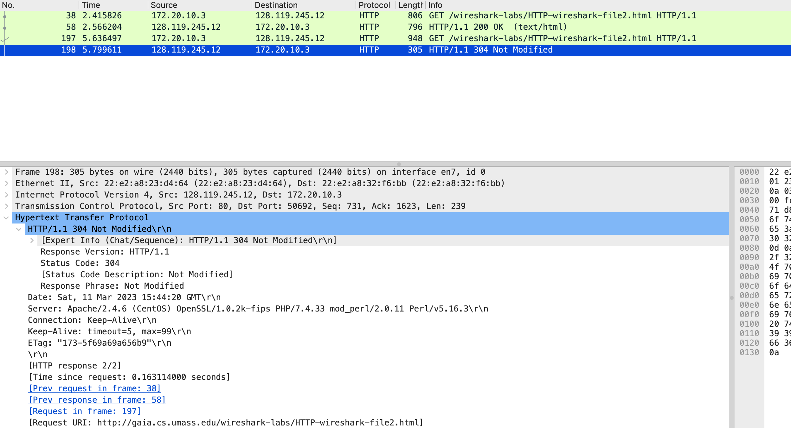
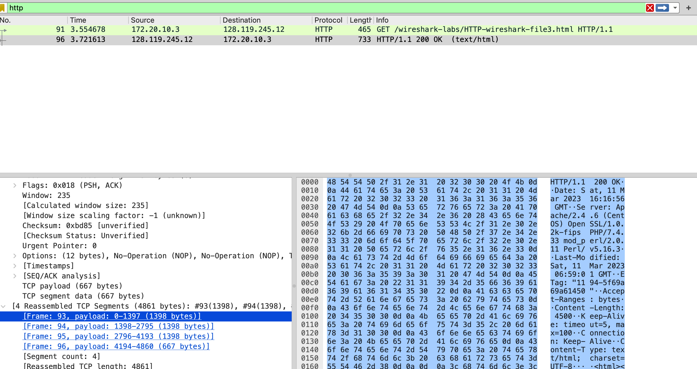

# Networks_HW_1

### Задание 1

Вопросы:
1. Использует ли ваш браузер HTTP версии 1.0 или 1.1? Какая версия HTTP работает на
сервере? 
> **В обоих случаях 1.1**

2. Какие языки (если есть) ваш браузер может принимать? В захваченном сеансе какую еще
информацию (если есть) браузер предоставляет серверу относительно
пользователя/браузера?
> **Принимает язык: en-us, пишет что он может принимать: Encoding, формат данных (text/html, application/* и другие)**
3. Какой IP-адрес вашего компьютера? Какой адрес сервера gaia.cs.umass.edu? 
> **Мой компьютер: 172.20.10.3, Сервер: 128.119.245.12**
4. Какой код состояния возвращается с сервера на ваш браузер? 
> **200 OK**
5. Когда HTML-файл, который вы извлекаете, последний раз модифицировался на сервере? 
> **11 марта 2023 06:59:01 GMT**
6. Сколько байтов контента возвращается вашему браузеру? 
> **128**

### Задание 2

(С помощью браузера Safari это не воспроизводится и этот дуралей зачем-то запрашивает левую информацию на том же сайте при обновлении и получает 404 Not Found )

1. Проверьте содержимое первого HTTP-запроса GET. Видите ли вы строку «IF-MODIFIEDSINCE» в HTTP GET?
> **В первый раз такого нет**
2. Проверьте содержимое ответа сервера. Вернул ли сервер содержимое файла явно? Как вы
это можете увидеть?
> **Вернул, в конце он полевка текст html выводит**
3. Теперь проверьте содержимое второго HTTP-запроса GET (из вашего браузера на сторону
сервера). Видите ли вы строку «IF-MODIFIED-SINCE:» в HTTP GET? Если да, то какая
информация следует за заголовком «IF-MODIFIED-SINCE:»?
> **Такая строчка есть и это тоже дата, что и в первом ответе сервера Last Modified**
4. Какой код состояния HTTP и фраза возвращаются сервером в ответ на этот второй запрос
HTTP GET? Вернул ли сервер явно содержимое файла? 
> **304 Not Modified. Не вернул, даже видно что размер пакета меньше чем при получении файла**

### Задание 3

Все просто пришло одним пакетом
1. Сколько сообщений HTTP GET отправил ваш браузер? Какой номер пакета в трассировке
содержит сообщение GET?
> **Только 1 GET**
2. Какой номер пакета в трассировке содержит код состояния и фразу, связанные с ответом
на HTTP-запрос GET?
> **1**
3. Сколько сегментов TCP, содержащих данные, потребовалось для передачи одного HTTP ответа?
> **4**
4. Есть ли в передаваемых данных какая-либо информация заголовка HTTP, связанная с
сегментацией TCP? 
> **Нет, про это знает более низкий уровень**

### Задание 4

Safari опять пытался отправлять непонятные побочные запросы, мне теперь очень интересно зачем.

1. Сколько HTTP GET запросов было отправлено вашим браузером? На какие Интернет адреса были отправлены эти GET-запросы?
> **3 GET запроса. 128.119.245.12(для просто html, 128.119.245.12(для 1 картинки), 178.79.137.164(для 2 картинки))**
2. Можете ли вы сказать, загрузил ли ваш браузер два изображения последовательно или
они были загружены с веб-сайтов параллельно? Объясните 
> **Нормальных цифр найти не получилось, но раз GET запрос для второй картинки был отправлен до того как получили ответ для первой, то видимо параллельно. **

### Задание 5

1. Каков ответ сервера (код состояния и фраза) в ответ на начальное HTTP-сообщение GET от
вашего браузера?
> **401 Unouthorized**
2. Когда ваш браузер отправляет сообщение HTTP GET во второй раз, какое новое поле
включается в сообщение HTTP GET?
> **Authorization: * ,Cridentials**
