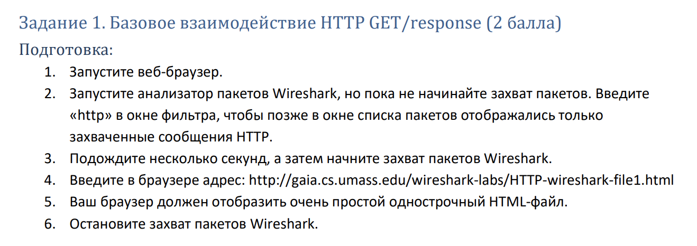
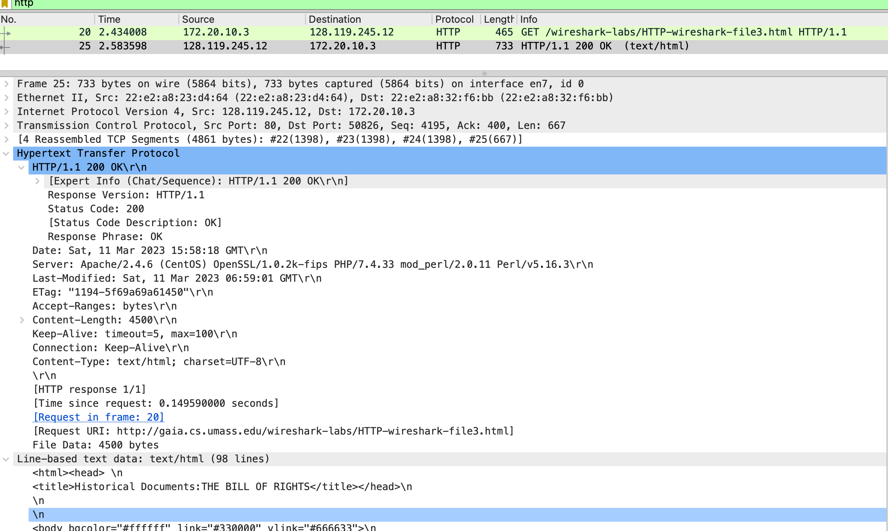
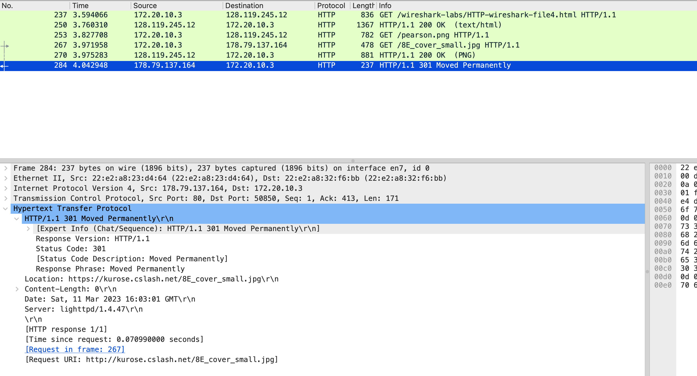
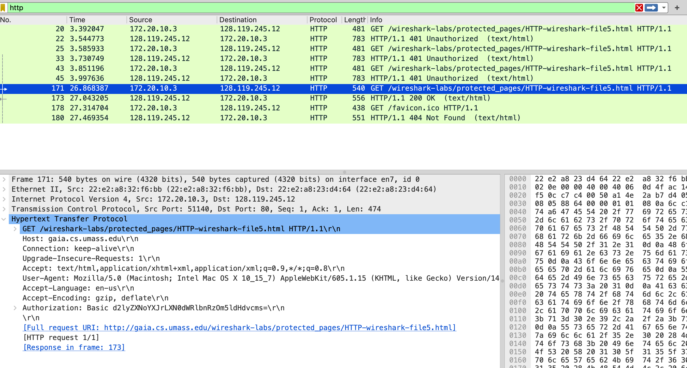

# Networks_HW_1

### Задание 1

Вопросы:
1. Использует ли ваш браузер HTTP версии 1.0 или 1.1? Какая версия HTTP работает на
сервере? Marked text
2. Какие языки (если есть) ваш браузер может принимать? В захваченном сеансе какую еще
информацию (если есть) браузер предоставляет серверу относительно
пользователя/браузера?
> **Answer**
3. Какой IP-адрес вашего компьютера? Какой адрес сервера gaia.cs.umass.edu? 
> **Answer**
4. Какой код состояния возвращается с сервера на ваш браузер? Marked text
5. Когда HTML-файл, который вы извлекаете, последний раз модифицировался на сервере? Marked text
6. Сколько байтов контента возвращается вашему браузеру? Marked text

### Задание 2

### Задание 3

### Задание 4

### Задание 5

